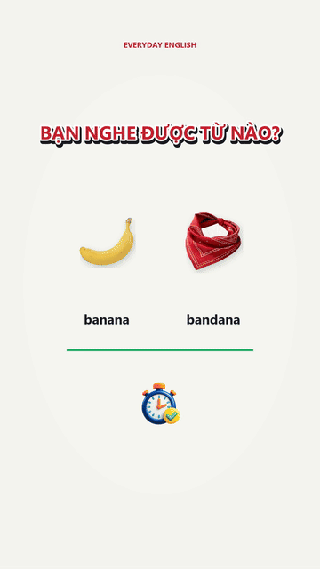

# English Vocab Video Starter

**Bộ khởi tạo video học tiếng Anh dọc theo format Listen & Choose**, có lời dẫn tiếng Việt, phát âm tiếng Anh, thời gian đoán, giải thích sau đáp án và CTA cuối video.

> Đây là bộ khởi đầu dành cho Codex Desktop trên Windows. Người dùng cần tự cấu hình tài khoản ElevenLabs và một dịch vụ CIT Voice Studio có thể truy cập từ máy của mình.

## Bắt đầu nhanh

1. Tải repo bằng **Code → Download ZIP** rồi giải nén.
2. Mở [`docs/HUONG_DAN_CAI_DAT.pdf`](docs/HUONG_DAN_CAI_DAT.pdf) để làm theo hướng dẫn có hình; bản chữ nằm ở [`HUONG_DAN_SETUP.md`](HUONG_DAN_SETUP.md).
3. Cài Python 3.12 x64 và FFmpeg, sau đó chạy `video-template\setup_windows.bat`.
4. Cài skill `codex-skill\english-vocab-10-keywords` vào `%USERPROFILE%\.codex\skills\`.
5. Điền cấu hình giọng đọc riêng trong `video-template\.env`, mở thư mục `video-template` bằng Codex và yêu cầu tạo tập mới.

## Video mẫu

Repo có một bản render mẫu để người dùng hình dung kết quả trước khi cấu hình giọng đọc:

[](samples/mode-b-silent-preview.mp4)

Bấm vào preview để mở video MP4 đầy đủ: [Mode B - Listen & Choose](samples/mode-b-silent-preview.mp4). Nếu trình duyệt không phát trực tiếp, hãy chọn **Download raw file** hoặc tải file về máy.

Video mẫu được tạo từ renderer đi kèm và dùng để minh họa bố cục, timer, lựa chọn từ và icon. Video tham khảo từ nguồn bên ngoài không được đưa vào repo; chỉ thêm media mới khi đã xác nhận quyền chia sẻ công khai.

## Format video

- Khung dọc 1080 × 1920, 30 fps, mục tiêu dưới 60 giây.
- Hai lựa chọn từ tiếng Anh trên mỗi thẻ; thanh xanh co đều hai đầu về tâm.
- Đáp án được làm nổi bật sau khoảng nghe/đoán; phần giải thích tiếng Việt xuất hiện sau khi lộ đáp án.
- Voice tiếng Việt từ CIT Voice Studio, tiếng Anh từ ElevenLabs v3; nhạc nền nhẹ và cue do bộ cài tự tạo.
- Hình minh họa phải khớp từng từ. Bản public không kèm ảnh tách từ video tham khảo; hãy dùng hình tự tạo hoặc hình có quyền sử dụng phù hợp.

Gói renderer hiện có dữ liệu minh họa **4 cặp (8 lựa chọn)**. Muốn video có 10 từ hiển thị, dùng 5 cặp. Skill mô tả cách giữ nhịp, giải thích, hình và CTA; renderer đi kèm là biến thể Mode B.

## Cấu trúc

| Đường dẫn | Nội dung |
| --- | --- |
| `codex-skill/english-vocab-10-keywords/` | Skill Codex dùng lại cho các tập mới |
| `video-template/` | Renderer, dữ liệu cặp từ, timing, mixer và script cài đặt |
| `samples/` | Video mẫu và ảnh preview được tạo từ project |
| `docs/HUONG_DAN_CAI_DAT.pdf` | Hướng dẫn minh họa cho người mới |
| `HUONG_DAN_SETUP.md` | Hướng dẫn đầy đủ dạng văn bản |
| `LICENSE.md` | Điều khoản cộng đồng: tự dùng/tạo video, không bán lại hoặc đóng gói lại bộ mã nguồn |

## Cấu hình giọng đọc

- Tạo `video-template\.env` từ `.env.example` và nhập API key ElevenLabs của chính bạn. API key CIT chỉ cần nếu dịch vụ CIT của bạn yêu cầu.
- Dùng voice ID được cấp phép cho tài khoản của bạn; model mặc định là `eleven_v3`.
- CIT Voice Studio phải chạy tại địa chỉ bạn truy cập được. `127.0.0.1` chỉ đúng khi CIT chạy trên chính máy đó.
- Không đưa `.env`, API key, token, giọng mẫu cá nhân hoặc video render vào repo.

## Tạo và render một tập

Trong PowerShell, ở thư mục `video-template`:

```powershell
.\.venv\Scripts\python.exe generate_reference_mode_b_hybrid_voice.py
.\.venv\Scripts\python.exe render_reference_mode_b_source_template.py --out reference_mode_b_source_template_silent.mp4
.\.venv\Scripts\python.exe mix_reference_modes.py --mode b
```

Trước khi render, đặt ảnh hợp lệ cho mỗi lựa chọn trong `video-template\source_research\reference_b_cutouts\` và cập nhật tên ảnh ở `reference_modes_data.py`. Nếu thiếu ảnh, renderer sẽ hiện khung nhắc thêm hình thay vì lấy ảnh từ video tham khảo.

## An toàn, tài nguyên và giấy phép

- Chỉ đưa lên repo những mã nguồn, hình ảnh, âm thanh và video mà bạn có quyền chia sẻ.
- File `.env` và khóa dịch vụ luôn ở máy người dùng; `.gitignore` đã loại trừ các file đó.
- Xem `video-template/ASSET_NOTES.md` trước khi thêm media.
- Bộ mã nguồn dùng điều khoản cộng đồng riêng trong [`LICENSE.md`](LICENSE.md): miễn phí tải, cài và tự dùng để tạo video; không bán lại, đóng gói lại hoặc phân phối bộ mã nguồn như một sản phẩm riêng.
- Đây là điều khoản sử dụng riêng, không phải giấy phép mã nguồn mở chuẩn như MIT. Quyền đối với ảnh, nhạc, giọng đọc, API và video đầu ra còn phụ thuộc giấy phép của từng tài nguyên/dịch vụ.

## Cập nhật

Tải bản mới nhất tại **Releases** khi chủ repo phát hành phiên bản mới. Bản được tạo bằng **Use this template** là một repo riêng và không tự đồng bộ các cập nhật của repo gốc.

## Hỗ trợ

Nếu cài đặt gặp lỗi, gửi nội dung lỗi đã xóa API key/đường dẫn riêng tư. Không gửi file `.env`.
